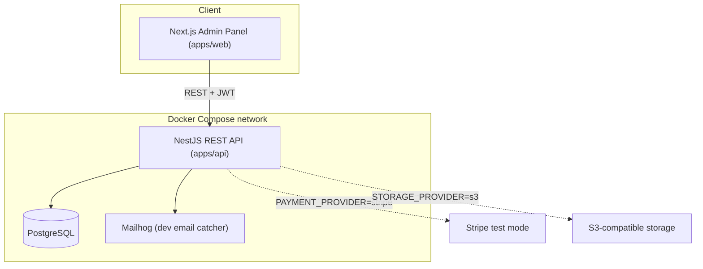
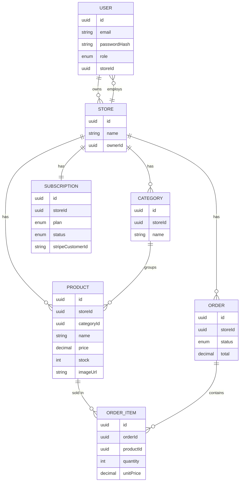

# Store Management SaaS — Architecture

**Status:** Build complete and verified. Real Postgres/Redis service containers, a green CI pipeline on every push/PR, an automated e2e suite, and a full manual browser-testing pass are all in place. PostgreSQL Row-Level Security covers `products`, `categories`, and `orders`. What's not yet done: live cloud deployment, and two third-party integrations beyond test/local mode — Stripe live mode and a real S3/R2 bucket. See [Production Readiness](#17-production-readiness) below, and [CHANGELOG.md](./CHANGELOG.md) for the full build and testing history.

## 1. Overview

A multi-tenant SaaS application for managing retail stores. Store owners sign up, subscribe to a plan, and use an admin panel to manage their store's product catalog, inventory, and orders. Store owners can invite staff with limited permissions. A platform-level SuperAdmin oversees all tenant stores and subscriptions.

This is a back-office / management tool, not a public customer-facing storefront. "Test payment" refers to SaaS subscription billing (store owners paying to use the platform), not end-customer checkout.

## 2. Scope & Key Assumptions

- **Multi-tenant**: each Store is an isolated tenant; StoreOwner/Staff only see their own store's data.
- **Admin-only frontend**: the Next.js app is an authenticated back-office panel, not a public shop.
- **"Test payment" = subscription billing** (Free/Pro plans), implemented as a swappable provider — mock by default, Stripe test mode optional.
- **MVP-grade, not enterprise-hardened**: a real, working foundation covering every requested piece. Full commercial-scale hardening (security audits, full observability, load testing at production scale) is out of scope.
- **Cloud deployment**: Docker images are ready to deploy, and CI runs on every push/PR. The actual deploy step on a live cloud account is a separate, manual decision (see [Deployment](#16-deployment)) — CI has no deploy job.

## 3. Tech Stack

| Layer | Choice | Notes |
|---|---|---|
| Frontend | Next.js 14 (App Router, standalone output), TypeScript, TailwindCSS, TanStack Query | Admin panel |
| Backend | NestJS, TypeScript | REST API |
| ORM | TypeORM | Migrations via the TypeORM CLI |
| Database | PostgreSQL 16 | |
| Auth | JWT (access + refresh) via Passport.js, bcrypt | |
| Validation | class-validator / class-transformer (API), Zod (frontend) | |
| API docs | @nestjs/swagger (OpenAPI) | Live docs at `/api/docs` |
| Testing | Jest (unit), Supertest (API/e2e) | |
| Logging | nestjs-pino (structured JSON) | |
| Containerization | Docker, Docker Compose | |
| Automation | GitHub Actions | CI (`ci.yml`) on every push/PR — lint, unit, e2e against real service containers, both builds; plus an on-demand database-backup workflow (`backup.yml`) |
| Monorepo | pnpm workspaces | `apps/api`, `apps/web` |

## 4. High-Level Architecture



## 5. Repository Structure

```
store-saas/
├── apps/
│   ├── api/                 # NestJS backend
│   │   ├── src/
│   │   │   ├── auth/
│   │   │   ├── users/                # entities/user.entity.ts
│   │   │   ├── stores/                # entities/store.entity.ts, staff sub-resource
│   │   │   ├── subscriptions/         # entities/subscription.entity.ts
│   │   │   ├── categories/
│   │   │   ├── products/              # entities/, search/filter/pagination, image upload
│   │   │   ├── orders/                # entities/order.entity.ts, order-item.entity.ts
│   │   │   ├── billing/               # PaymentProvider, MockPaymentProvider, StripePaymentProvider, WebhookEvent (idempotency)
│   │   │   ├── admin/                 # SuperAdmin platform-wide store management
│   │   │   ├── uploads/               # StorageProvider, LocalDiskStorageProvider, S3StorageProvider
│   │   │   ├── mail/                  # MailProvider, MailhogMailProvider, SmtpMailProvider
│   │   │   ├── metrics/               # Prometheus /metrics endpoint + HTTP request interceptor
│   │   │   ├── common/       # guards, filters, decorators, enums, dto, utils
│   │   │   └── database/     # data-source.ts, migrations/, seed.ts
│   │   ├── Dockerfile
│   │   └── test/
│   └── web/                 # Next.js admin panel
│       └── src/
│           ├── app/           # (app) route group: dashboard, products, categories,
│           │                  # orders, staff, billing, admin/stores + login/register
│           ├── components/    # ui/ primitives, layout/, products/, orders/
│           ├── hooks/         # TanStack Query hooks per resource
│           └── lib/           # api client, typed api.ts, auth-context, types
├── scripts/                 # backup.sh, restore.sh, load-test.js
├── monitoring/              # prometheus.yml, alerts.yml (+ alerts.test.yml)
├── db/init/                 # 01-create-app-runtime-role.sql (RLS role)
├── docker-compose.yml
├── .github/workflows/        # ci.yml, backup.yml
├── docs/
│   ├── ARCHITECTURE.md      # this file
│   └── CHANGELOG.md         # build & testing history
├── .env.example
└── README.md
```

## 6. Data Model



`ORDER` is quoted in the diagram since it's a reserved word in some renderers.

## 7. Roles & Permissions

| Capability | SuperAdmin | StoreOwner | Staff |
|---|:---:|:---:|:---:|
| Manage all stores (platform-wide) | Yes | – | – |
| Suspend / activate a store | Yes | – | – |
| Manage own store settings | – | Yes | – |
| Invite / remove staff | – | Yes | – |
| View / manage billing | – | Yes | – |
| Manage categories & products | – | Yes | Yes |
| Manage orders | – | Yes | Yes |
| Upload product images | – | Yes | Yes |

Enforced two ways: (1) a `RolesGuard` + `@Roles(...)` decorator per route, reading the role from the JWT payload; (2) tenant isolation — every service method that touches a Product, Category, Order, or staff User takes `storeId` as its first parameter and includes it directly in the query, sourced exclusively from `@CurrentUser().storeId` (the JWT-verified session), never from client input. `products`, `categories`, and `orders` additionally have PostgreSQL Row-Level Security as a second, database-level enforcement layer, independent of this application-level filtering. `order_items` has no `store_id` column of its own and is scoped only through its parent `orders` row — every access to it goes through `OrdersService`.

## 8. API Design (representative)

Full live spec at `/api/docs` (Swagger) once running.

| Method | Endpoint | Access | Description |
|---|---|---|---|
| POST | `/auth/register` | Public | Create StoreOwner + Store + Free subscription; sets auth cookies |
| POST | `/auth/login` | Public | Sets auth cookies (access + refresh + CSRF) |
| POST | `/auth/refresh` | Authenticated | Rotate tokens, re-sets cookies |
| POST | `/auth/logout` | Authenticated | Revoke refresh token; clears all auth cookies |
| GET | `/auth/me` | Authenticated | Current session's user |
| POST | `/auth/request-password-reset` | Public | Email a reset link if the address exists (always 204 either way) |
| POST | `/auth/reset-password` | Public | Complete a reset using the emailed token; single-use, also revokes the session |
| GET/PATCH | `/stores/me` | Owner, Staff | Current store |
| GET/POST | `/stores/me/staff` | Owner | List / invite staff |
| PATCH/DELETE | `/stores/me/staff/:id` | Owner | Update / remove staff |
| GET/POST | `/products` | Owner, Staff | List (search/filter/paginate) / create |
| GET/PATCH/DELETE | `/products/:id` | Owner, Staff | Detail / update / delete |
| POST | `/products/:id/image` | Owner, Staff | Upload image |
| GET/POST | `/categories` | Owner, Staff | List / create |
| GET/POST | `/orders` | Owner, Staff | List (filter/paginate) / create |
| GET/PATCH | `/orders/:id` | Owner, Staff | Detail / update status |
| GET | `/billing/subscription` | Owner | Current plan & status |
| POST | `/billing/checkout-session` | Owner | Start upgrade (mock or Stripe test mode) |
| POST | `/billing/webhook` | Public, signature-verified | Payment provider webhook |
| GET/PATCH | `/admin/stores` | SuperAdmin | Platform-wide store management |

`/products` and `/orders` support `?search=&category=&minPrice=&maxPrice=&status=&page=&limit=`.

## 9. Auth & Security

- Passwords hashed with bcrypt. Short-lived JWT access token + longer-lived, rotated refresh token.
- Every DTO validated via `class-validator` (global `ValidationPipe`, whitelist mode).
- `helmet` for HTTP security headers, `@nestjs/throttler` rate-limits every public auth endpoint: `register` 5/min, `login` 10/min, `refresh` 30/min, `request-password-reset` 5/min, `reset-password` 10/min. Health/metrics endpoints are exempt from the global limit so monitoring probes can't trip it.
- CORS restricted to the admin panel's origin. Secrets only via `.env`, never committed. TypeORM parameterizes all queries.
- **Tokens are stored in httpOnly cookies**, not `localStorage`. `access_token` and `refresh_token` (scoped to `path=/auth`) are set via `Set-Cookie`, invisible to JavaScript. A third cookie, `csrf_token`, is deliberately not `httpOnly` — the frontend echoes it back in an `X-CSRF-Token` header (double-submit pattern). `CsrfGuard` checks this on every mutating request from a cookie-authenticated caller; a Bearer-token caller (Swagger UI, curl) is exempt.
  - `COOKIE_SECURE` (env var, default `false`) gates the `Secure` flag — deliberately not derived from `NODE_ENV`, since `docker-compose.yml` sets `NODE_ENV=production` while still serving plain HTTP locally.
  - `SameSite=Lax`, correct as long as the frontend and API share a registrable domain. Would need `SameSite=None; Secure=true` if they were ever deployed on genuinely unrelated domains.

## 10. File Uploads

```ts
interface StorageProvider {
  upload(file: Buffer, key: string): Promise<{ url: string }>;
}
```
- Two providers, selected via `STORAGE_PROVIDER` (default `local`): `LocalDiskStorageProvider` (Docker volume, served statically) or `STORAGE_PROVIDER=s3` for `S3StorageProvider` (any S3-compatible endpoint — AWS S3, R2, Spaces, MinIO).
- Uploaded bytes are validated against their claimed type via a magic-byte signature check, not just the client-supplied `Content-Type` header.
- **Access control on uploaded files:** none, by design — product images are treated as non-sensitive public assets. `/uploads/*` is served with no auth check and no per-tenant subpath; filenames are randomized (`${productId}-${randomUUID()}${ext}`) so they can't be enumerated, but anyone with the exact URL can view the image without logging in. Fine for product photos; would need a signed-URL layer for anything actually sensitive.

## 11. Email Notifications

```ts
interface MailMessage {
  to: string;
  subject: string;
  html: string;
}
interface MailProvider {
  send(message: MailMessage): Promise<void>;
}
```
- Two providers, selected via `MAIL_TRANSPORT` (default `mailhog`): `MailhogMailProvider` (dev email catcher at `http://localhost:8025`) or `MAIL_TRANSPORT=smtp` for `SmtpMailProvider` (real STARTTLS + AUTH, verified against a real production account with SPF/DKIM/DMARC).
- Sending is asynchronous: `MailQueueService.enqueue()` adds a job to a BullMQ/Redis queue; a separate worker does the actual send, with 5 retries and exponential backoff.
- Triggers: welcome email on registration, order confirmation (via the outbox pattern, so a failed email can't roll back a committed order), password-reset link. Low-stock alerts are a nice-to-have, not built.

## 12. Billing / Subscriptions

```ts
interface PaymentProvider {
  createCheckoutSession(params: CheckoutParams): Promise<{ url: string }>;
  handleWebhook(payload: unknown, signature: string): Promise<void>;
}
```
- `MockPaymentProvider` (default): simulates an instant successful checkout, no external calls.
- `StripePaymentProvider` (`PAYMENT_PROVIDER=stripe`): real Stripe Checkout, test mode.
- Webhook handling is idempotent (a `webhook_events` table skips redelivered events) and covers both checkout completion and subscription cancellation.
- Plans (placeholder limits): **Free** — up to 20 products, 1 staff seat. **Pro** — unlimited products, up to 10 staff seats.

## 13. Testing Strategy

- **Unit tests** (Jest): business logic — RBAC checks, stock decrement on order creation, plan-limit enforcement.
- **API/e2e tests** (Supertest): run against a real Postgres, no mocking at the database layer — both locally and in CI (against a real service container). Coverage: register→login, RBAC denial cases, product search/filter, order → stock side-effects, tenant isolation (including RLS enforcement), billing/staff-limit edge cases.
- **Manual browser testing**: `docs/TESTING_CHECKLIST.md`, run end to end in a real browser tab against a real build.
- Target: solid coverage of core flows and permission boundaries, not a 100%-coverage mandate.

## 14. Logging & Error Handling

- Structured JSON logs via `nestjs-pino`. `RequestIdMiddleware` tags every request with a correlation ID that appears in both the log line and the error response body.
- Global `AllExceptionsFilter` returns a consistent shape: `{ statusCode, message, error, timestamp, path, requestId }`. 5xx errors are logged with full stack trace server-side but never leak internals to the client.

## 15. Docker & Local Development

`docker-compose.yml` runs all four services: `postgres`, `api`, `web`, `mailhog`. The `api` container runs migrations against the compiled data source, then starts the server.

```bash
git clone <repo-url>
cd store-saas
cp .env.example .env
docker-compose up --build
# API      → http://localhost:3000  (Swagger: /api/docs)
# Web      → http://localhost:3001
# Mailhog  → http://localhost:8025
```

A seed script (`docker compose exec api node dist/database/seed.js`) creates a demo SuperAdmin plus a demo store with sample data.

### CI/CD Pipeline

`.github/workflows/ci.yml` runs on every push/PR to `main`: install → lint both apps → unit tests → real Postgres 16 + Redis 7 service containers → migrations → e2e tests (connected as `app_runtime`, genuinely exercising RLS) → build both apps. No deploy job — that depends on a target chosen in [Deployment](#16-deployment) below. `.github/workflows/backup.yml` handles on-demand database backups.

## 16. Deployment

Everything is containerized, so any Docker-capable host works. Two options, written up as step-by-step runbooks in **[docs/DEPLOYMENT.md](DEPLOYMENT.md)**:

| Option | Effort | Notes |
|---|---|---|
| VPS + `docker-compose` | Low-medium | Full control, cheapest, no vendor lock-in |
| Managed container platform (e.g. Railway, Render, Fly.io) | Very low | Push-to-deploy, good for demos, small free/cheap tier |

Both are standard, well-documented paths — follow the runbook directly against your own account. `docs/DEPLOYMENT.md` also has rollback guidance (previous-image redeploy, `migration:revert` for schema changes, restore-from-backup as the last resort).

## 17. Production Readiness

This is a production-oriented MVP foundation, not yet hardened for commercial-scale workloads. `README.md`'s "Known limitations" section links here.

**Before any real deployment**
- Actually deploying to a cloud target and verifying it live — no live account has been deployed to yet
- Real Stripe billing in an actual account — `createCheckoutSession` has never made a real call to `api.stripe.com`
- A real S3/R2/Spaces bucket — `S3StorageProvider` is implemented and tested against a local S3-compatible server, not a real bucket
- Automated backups against the Dockerized or a cloud Postgres specifically (verified so far against a real local Postgres only); `backup.yml`'s daily schedule is disabled until a real `DATABASE_URL` secret exists
- Centralized monitoring/alerting on top of the existing `/metrics` endpoint — nothing is scraping it yet
- Next.js 14 and `@nestjs/core` are both a major version behind, with CVEs only patched upstream — flagged, not fixed
- Rate limiting is still one blanket global limit for most routes, beyond the auth-specific ones listed in [Auth & Security](#9-auth--security)

**Valuable next**
- Alerts on top of the metrics endpoint
- A staging environment and a rehearsed rollback

**For scale, not correctness**
- Distributed tracing
- Autoscaling, read replicas, advanced caching, multi-region

### Other things worth knowing

- Free/Pro plan limits are placeholder values — one config change.
- Orders currently model owner/staff-entered sales (POS-style), not a public customer storefront.
- Final cloud target (VPS vs. managed platform) is still an open choice — both runbooks are ready.
- No admin-side "reset this other user's password" tool exists yet — only the self-service email flow.

---

For the full build history — what was tried, what broke, what was found and fixed along the way — see **[CHANGELOG.md](./CHANGELOG.md)**.
